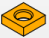
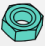
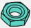
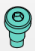
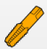
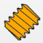

#  Descripción de las barras de herramientas

A continuación vamos a describir el significado de los iconos que aparecen en ambas barras de herramientas del banco de trabajo *Fasteners*.

## Comandos

En la tabla siguiente tenemos los iconos, su nombre original, su traducción y un pequeño resumen de para que sirve. En el apartado de utilización veremos como utilizarlos.

| Icono | Nombre original | Nombre traducidos | Descripción |
|:-:|---|---|---|
|  | Flip | Voltear | Invierte la orientación |
|  | Move | Mover | Mueve a una nueva localización |
|  | Shape | Simplificar Forma | Crea una copia simplificada del objeto seleccionado y lo hace no paramétrico |
|  | Match Type Inner | Tipo de coincidencia interior | Hacer coincidir los tornillos por el diámetro interior de la rosca (agujero roscado) |
|  | Match Type Outer | Tipo de coincidencia exterior | Hacer coincidir los tornillos por el diámetro exterior de la rosca (agujero pasante) |
|  | BOM - Bill Of Materials | Lista de materiales | Genera la lista de materiales |
|  | Screw Calculator | Calculadora de tornillos | Muestra una calculadora del diámetro del agujero según el tipo de tornillo |
|  | Chamfer Hole | Chaflán o bisel en orificio | Agujeros con chaflán para tornillos avellanados |
|  | Change Parameters | Cambiar parámetros | Cambia los parámetros de los elementos seleccionados |

## Tornillos

En la siguiente tabla tenemos la descripción de los tornillos en el orden que aparecen en la barra de herramientas.

| Icono | Norma o tipo | Descripción |
|:-:|:-:|---|
|  | PEM | Tuerca métrica autoajustable PEM |
|  | PEM | Separador métrico autocierre |
|  | PEM | Perno métrico prisionero de cierre automático |
|  | PCB | Separador |
|  | PCB | Distanciador |
|  | ISO 4017 | Tornillo milimétrico de cabeza hexagonal |
|  | ISO 4014 | Tornillo milimétrico de cabeza hexagonal con espiga |
|  | EN 1662 | Pernos de cabeza hexagonal con valona |
|  | EN 1665 | Tornillo de cabeza hexagonal con valona. Serie gruesa |
|  | ISO 4762 | Tornillo de cabeza cilíndrica con hueco hexagonal  |
|  | DIN 7984 | Tornillo con hexagono interior y cabeza baja |
|  | ISO 7380-1 | Parte 1: Tornillo de cabeza cilíndrica abombada con hueco hexagonal |
|  | ISO 7380-2 | Tornillo de cabeza cilíndrica abombada con hueco hexagonal con collar |
|  | ISO 10642 | Tornillo de cabeza hexagonal avellanada con capacidad de carga reducida |
|  | ISO 2009 | Tornillo avellanado con ranura |
|  | ISO 2010 | Tornillos de cabeza avellanada, abombada y ranurada |
|  | ISO 1580 | Tornillos de cabeza cilíndrica, redondeada y ranurada |
|  | ISO 1207 | Tornillo de cabeza cilíndrica ranurada. Producto de clase A |
|  | DIN 967 | Tornillo con arandela de cabeza troncónica cruciforme. Clase A |
|  | ISO 7045 | Tornillo de cabeza cilíndrica redondeada con hueco cruciforme tipo H o tipo Z. Producto de clase A |
|  | ISO 7046 | Tornillo de cabeza avellanada con hueco cruciforme tipo H o tipo Z. Producto de clase A. Parte 1: Acero de calidad 4.8. Parte 2: Acero de calidad 8.8, acero inoxidable y metales no ferrosos |
|  | ISO 7047 | Tornillo de cabeza avellanada, abombada y hueco cruciforme tipo H o tipo Z. Producto de clase A |
|  | ISO 7048 | Tornillo de cabeza cilíndrica con hueco cruciforme |
|  | ISO 14579 | Tornillo de cabeza cilíndrica con hueco hexalobular |
|  | ISO 14580 | Tornillo con cabeza redonda con hueco hexalobular. |
|  | ISO 14582 | Tornillo de cabeza avellanada con hueco hexalobular, cabeza alta |
|  | ISO 14583 | Tornillo con cabeza cilíndrica redondeada con hueco hexalobular. |
|  | ISO 14584 | Tornillo de cabeza avellanada abombada con hueco hexalobular |
|  | ISO 7379 | Tornillo de resalto o de hombro de cabeza hueca hexagonal |
|  | ISO 7089 | Arandela plana. Serie normal. Producto de clase A |
|  | ISO 7090 | Arandela plana achaflanada. Serie normal. Producto de clase A |
|  | ISO 7092 | Arandela plana. Serie estrecha. Producto de clase A |
|  | ISO 7093-1 | Arandela plana. Serie ancha. Parte 1: Producto de clase A. Parte 2: Producto de clase C |
|  | ISO 7094 | Arandela plana. Serie extra ancha. Producto de clase C |
|  | ISO 4026 | Tornillo sin cabeza con hueco hexagonal y punta plana |
|  | ISO 4027 | Tornillo sin cabeza con hueco hexagonal y punta troncocónica |
|  | ISO 4028 | Tornillo sin cabeza con hueco hexagonal y extremo con pivote |
|  | ISO 4029 | Tornillo sin cabeza con hueco hexagonal y extremo con cono embutido |
|  | ISO 4032 | Tuerca hexagonal normal, tipo 1. Producto de clases A y B |
|  | ISO 4033 | Tuerca hexagonal alta, tipo 2. Producto de clases A y B |
|  | ISO 4035 | Tuerca hexagonal baja biselada. Producto de clases A y B |
|  | EN 1661 | Tuerca hexagonal con brida |
|  | DIN 557 | Tuerca cuadrada |
|  | DIN 562 | Tuerca cuadrada baja |
|  | DIN 985 | Tuerca autoblocante |
|  | ASME B18.2.1 | Tornillo hexagonal UNC ASME B18.2.1 |
|  | ASME B18.2.1 con valona | Tornillo hexagonal UNC ASME B18.2.1 con valona |
|  | ASME B18.2.2 Maquina | Tuerca hexagonal UNC ASME B18.2.2 |
|  | ASME B18.2.2 | Tuerca hexagonal UNC ASME B18.2.2 |
|  | ASME B18.2.2 delgada | Tuerca hexagonal UNC ASME B18.2.2 |
|  | ASME B18.3 | Tornillo de cabeza cilíndrica con hueco hexagonal |
|  | ASME B18.3 | Tornillo de cabeza hexagonal avellanada con capacidad de carga reducida |
|  | ASME B18.3 | Tornillo de cabeza cilíndrica abombada con hueco hexagonal |
|  | ASME B18.3 | Tornillo de cabeza cilíndrica abombada con hueco hexagonal con collar |
|  | ASME B18.3 | Tornillo de resalto o de hombro de cabeza hueca hexagonal |
|  | ASME B18.3 | Tornillo sin cabeza con hueco hexagonal y punta plana |
|  | ASME B18.3 | Tornillo sin cabeza con hueco hexagonal y punta troncocónica |
|  | ASME B18.3 | Tornillo sin cabeza con hueco hexagonal y extremo con pivote |
|  | ASME B18.3 | Tornillo sin cabeza con hueco hexagonal y extremo con cono embutido |
|  | ASME B18.6.3 | Tornillo cilindrico con ranura |
|  | ASME B18.21.1 | Arandela plana estrecha |
|  |ASME B18.21.1  | Arandela plana normal |
|  | ASME B18.21.1 | Arandela plana ancha |
|  | DIN 975 | Macho de roscar (para generar roscas interiores) |
|  | UNE EN 10255 | Terraja de roscar (para generar roscas exteriores) |
|  | DIN 975 | Varilla roscada de rosca métrica extremos achaflanados de cualquier longitud |

