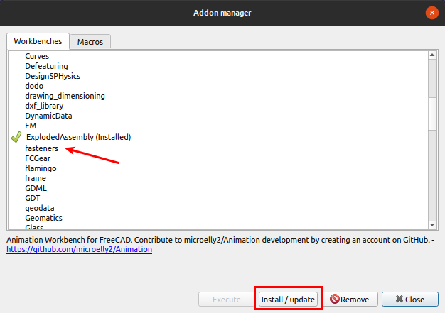
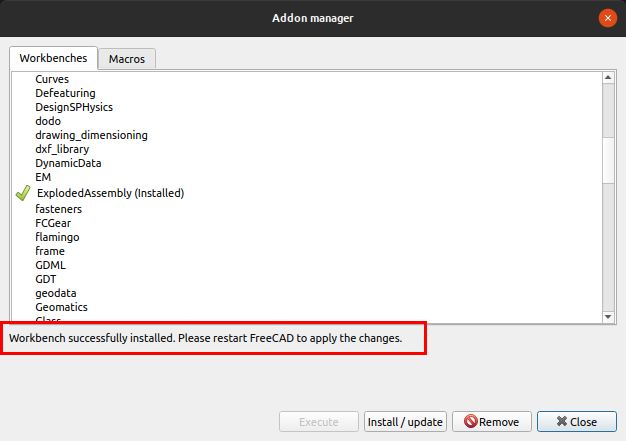

# Instalación

El icono del banco de trabajo *Fastener* es el que vemos a continuación.

| Icono del banco de trabajo Fasteners |
|:-:|
|  |
| Icono Fasteners |

Nos dirigimos a la entrada Addon manager del menú herramientas tal y como vemos en la imagen 1.

| Imagen 1 |
|:-:|
|  |
| Acceso a Addon manager |

Se nos despliega la ventana que vemos en la imagen 2, donde procedemos a localizar el banco de trabajo y a su instalación clicando en el botón correspondiente.

| Imagen 2 |
|:-:|
|  |
| Localizar fasteners en Addon manager |

Tras unos instantes la ventana nos mostrará un mensaje como el de la imagen 3, donde nos indica que para poder usarlo debemos reiniciar FreeCAD.

| Imagen 3 |
|:-:|
|  |
| Instalación finalizada |

La necesidad de reinicio se recuerda (imagen 4) cuando cerramos la ventana anterior.

| Imagen 4 |
|:-:|
|  |
| Aviso de necesidad de reinicio |

Una vez realizada la acción de reiniciar creamos un archivo nuevo y de la lista desplegable escogemos el nuevo banco de trabajo y veremos una ventana similaar a la de la imagen 5, donde se han destacado las nuevas herramientas disponibles con el banco de trabajo *Fasterners*.

| Imagen 5 |
|:-:|
|  |
| Banco de trabajo fasteners |

Ambas barras de herramientas se cargan en la interfaz cuando seleccionamos el banco de trabajo *fasteners*.
