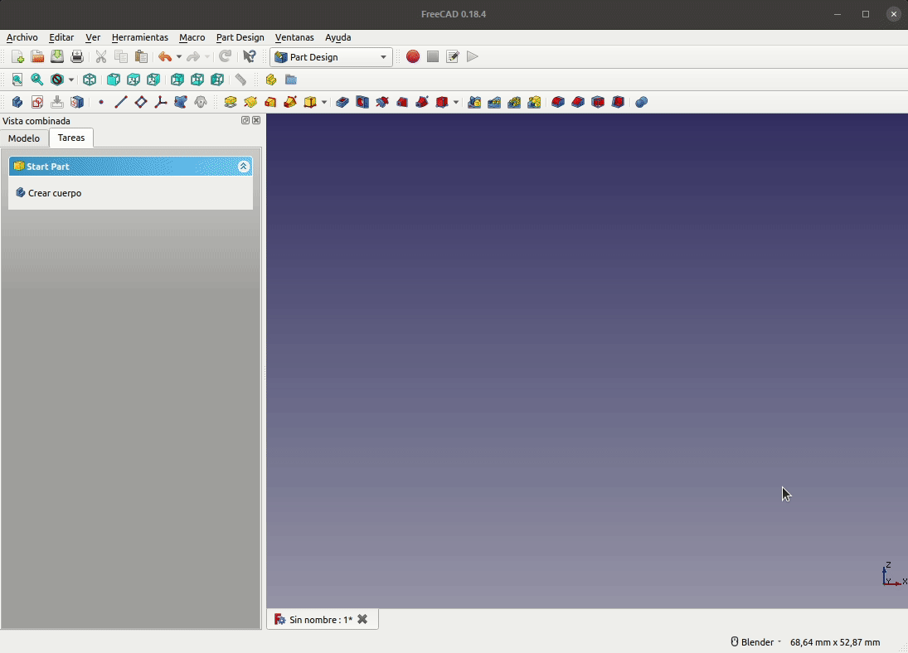
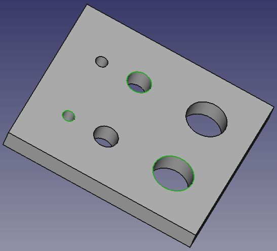
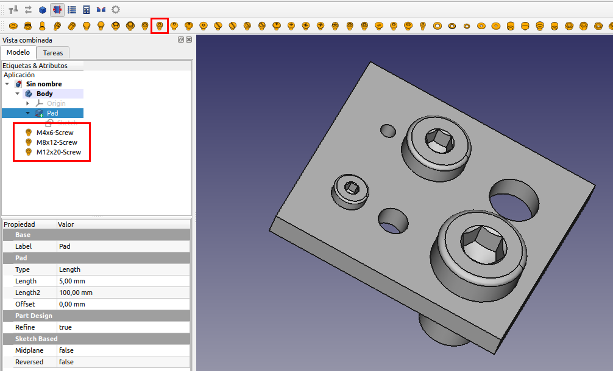
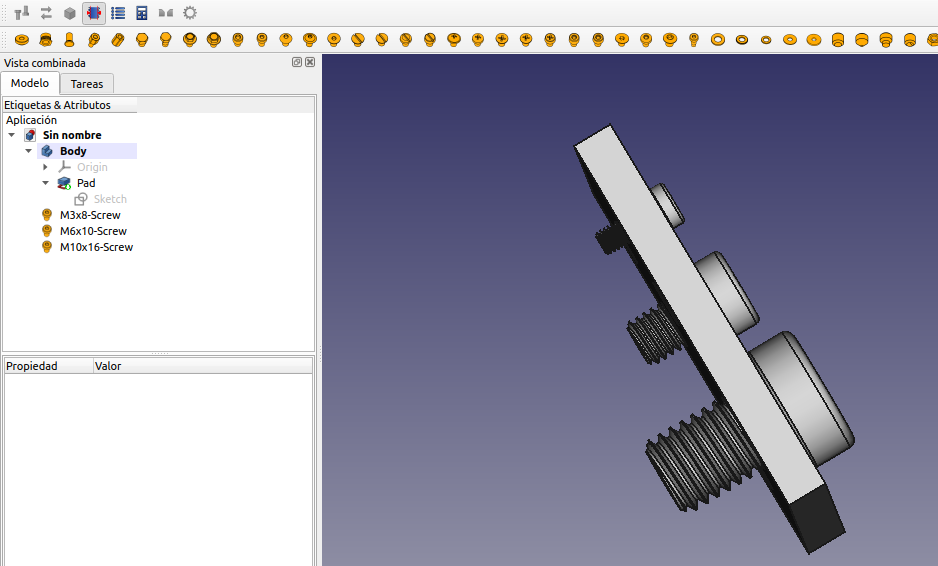
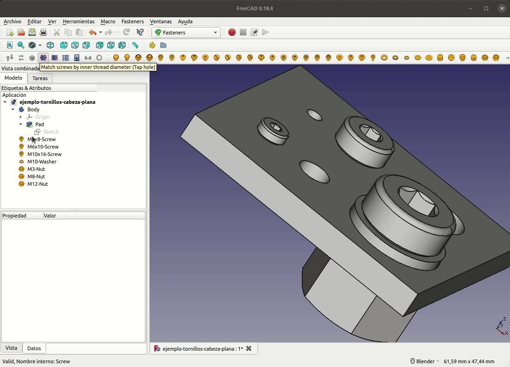
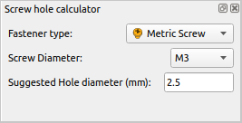
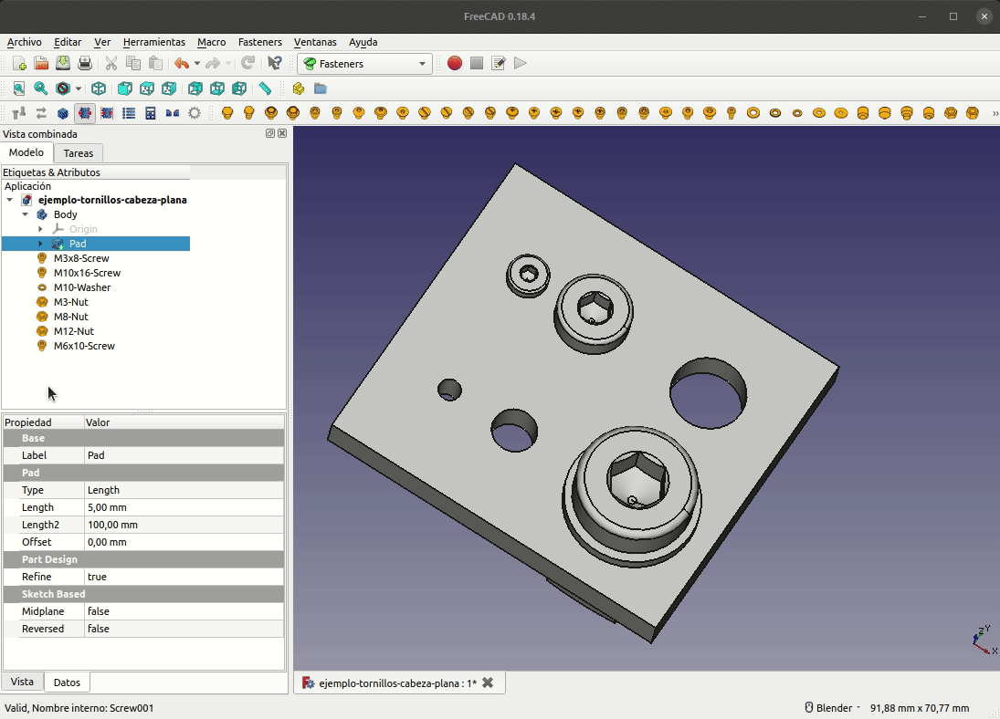
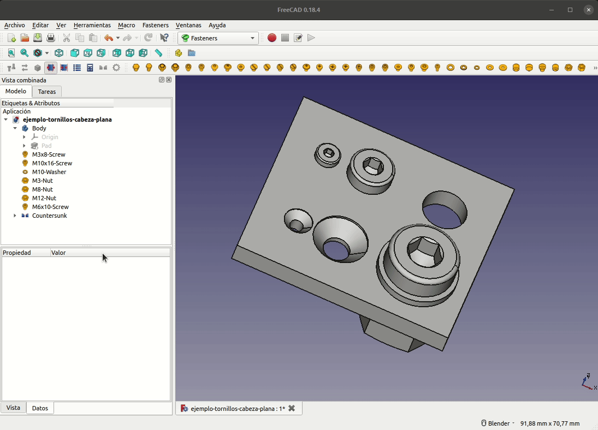
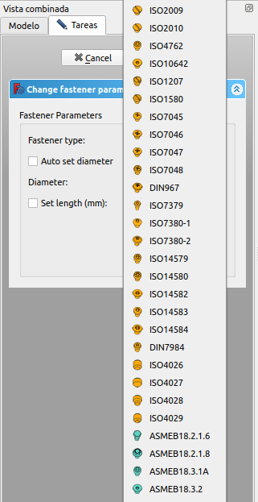

# Uso del banco de trabajo Fastener

El uso de este banco de trabajo es bastante sencillo. En un documento nuevo, o existente, seleccionamos el banco de trabajo, hacemos clic en el tipo de tornillo que queremos y una copia de este se situará en el origen de coordenadas del sistema.

## Uso simple

Al hacer clic en cualquiera de los tornillos, este tornillo se creará en la posición de origen con el tamaño predeterminado. Para cambiar el tamaño (métrica) o la longitud, seleccionamos el tornillo recién creado, luego vamos a la pestaña de datos en el panel de propiedades, y cambiamos el diámetro y la longitud. En la animación siguiente vemos este proceso para un tornillo concreto partiendo de un documento en blanco.

Si cambiamos la propiedad *thread* a *true* teniendo el tornillo seleccionado en vista combinada se representará la rosca del tornillo. Téngase en cuenta que un subproceso como este puede llevar una cantidad considerable de tiempo, durante el cual, FreeCAD no responderá.

En la imagen 1 podemos ver el resultado de crear la rosca en un tornillo concreto.

| Imagen 1 |
|:-:|
|  |
| Creación de la rosca en un tornillo |

## Copiando y modificando propiedades

En la animación siguiente vamos a partir de un tornillo cualquiera, le vamos a realizar copias y vamos a cambiar sus propiedades para ver el comportamiento de FreeCAD ante estos cambios.

Podemos observar como las copias se renombran de forma automática al modelo concreto de tornillo que corresponde con las propiedades asignadas.

## Colocación de un tornillo en su orificio

Lógicamente la pieza a la que vamos a agregar el tornillo debe tener orificios circulares. Para ver el funcionamiento vamos a partir de una simple pieza rectangular con unos cuantos orificios y vemos el funcionamiento de colocación de tornillos posicionados en esos agujeros. En la imagen 2 vemos el croquis de partida para obtener la pieza base extruyendolo 5mm.

| Imagen 2 ||
|:-:|:-:|
|  |  |
| Croquis de partida | Pieza extruida |

Para poner tornillos a los agujeros, seleccionamos el borde circular adecuado, o varios bordes, o la cara si queremos poner tornillos en todos los agujeros en esa cara. En la imagen 3 hemos seleccionado el borde de tres de los agujeros. Para seleccionar mas de un elemento recordamos que hay que mantener pulsada la tecla CTRL mientras hacemos clic en cada elemento.

| Imagen 3 |
|:-:|
|  |
| Selección del borde de los agujeros deseados |

El resultado de agregar el tornillo marcado a la selección lo vemos en la imagen 4.

| Imagen 4 |
|:-:|
|  |
| Colocación de tornillos en la selección |

Vemos como se coloca un tornillo en cada agujero adaptandose a las características del mismo, o sea tratando de hacer coincidir el diámetro del tornillo con el del orificio.

Ahora podemos cambiar las propiedades de estos tornillos para adaptarlos realmente a lo que queremos. En la imagen 5 vemos los resultados y los cambios realizados.

| Imagen 5 |
|:-:|
|  |
| Cambios realizados tras la colocación automática |

La propiedad offset sirve para separar el tornillo (o tuerca o arandela) del orificio seleccionado la distancia requerida, por ejemplo para colocar una arandela, como vemos en la animación siguiente.

## Uso de comandos

Veamos ahora el uso de la barra de herramientas de comandos.

### Flip. Invertir o reflejar

Hay veces que el tornillo no detecta la dirección correctamente y aparece al revés. Para corregir esto, cambiamos la propiedad "invert" a verdadero, o realizamos un volteo del tornillo presionando el botón "Flip" de la barra de herramientas.

Vamos a ejemplificar esto colocando tuercas a los tres tornillos y cambiándoles la orientación a la adecuada. En la animación siguiente vemos el proceso.

### Move. Mover o desplazar

Para mover un elemento de sujeción a un orificio diferente seleccionamos el elemento y posteriormente, con la tecla CTRL pulsada seleccionamos el borde del nuevo orificio. Cuando tengamos la selección completa hacemos clic en el botón "Move" y se generará el movimiento que ejemplificamos en la animación siguiente.

### Shape. Simplificar objetos

Cuando queremos compartir archivos con la extensión .FCStd que contienen tornillos (o elementos de otros bancos de trabajo paramétricos personalizados) con otras personas y, estas, no tienen instalados los bancos de trabajo en cuestión, obtendrán errores al intentar usar el archivo.

En el caso del banco de trabajo *Fastener*, si solamente necesitamos compartir las partes como tales sin sus propiedades y sin necesidad de cambiar los parámetros del objeto, podemos usar la función "Shape" (Simplificar) para convertir los elementos en formas simples. En realidad lo que hace esta función es crear una copia simple del objeto u objetos. Cuando finalicemos las copias podemos archivar nuestro fichero .FCStd en una copia de la que eliminaremos los elementos originales y el nuevo archivo podrá ser leído por una versión de FreeCAD sin el banco de trabajo instalado.

En la imagen 6 vemos el resultado de hacer esto con el tornillo M3 y como el elemento copia no tiene ninguna propiedad.

| Imagen 6 |
|:-:|
|  |
| Uso de Shape. Simplificar |

### Match Type Inner/Outer. Coincidencia interior/exterior

Estos dos botones, excluyentes entre si,  en realidad son botones de selección de la forma en la que queremos que los tornillos ajusten sus propiedades según el orificio seleccionado. Su funcionamiento lo vemos en la animación siguiente, donde vemos como con el botón *Match Type Inner* pulsado la métrica trata de ajustarse según el diámetro interior de la rosca (para crear rosca con los filetes del tornillo) y con el botón *Match Type Outer* la métrica se ajusta al diámetro exterior de la rosca (el agujero es pasante).

### BOM. Lista de materiales

Al pulsar en este botón se crea una hoja de cálculo con los elementos *fasteners* que hay en el diseño. En la imagen 7 vemos un ejemplo de creación de la lista de materiales. Hay que advertir que esta lista no se actualiza con los cambios por lo que, si estos existen, eliminamos la existente y la creamos de nuevo, o bien creamos una nueva ya que podemos tener todas las que queramos en el diseño.

| Imagen 7 |
|:-:|
|  |
| BOM. Lista de materiales |

### Calculadora de orificios

En la imagen 8 vemos la calculadora desplegada para un tornillo M3. En la lista desplegable *Fastener Type* escogemos el elemento del que queremos averiguar el diámetro del orificio y en * Screw diameter* seleccionamos el tamaño, En *Suggested* nos indicará el diámetro sugerido en milímetros.

| Imagen 8 |
|:-:|
|  |
| Calculadora |

### Chamfer Hole. Avellanador

Cuando se trabaja con tornillos avellanados es muy conveniente pasar a todos los orificios un avellanador que cree un chaflán donde se aloje el cono del tornillo. Este botón está pensador para este propósito.

Para su utilización se requiere que los orificios tengan los diámetros adaptados a los tornillos que se van a insertar. Por ejemplo para un tornillo M5 debemos preparar un orificio de 5 mm para un tornillo pasante o bien de 4,2 mm para un tornillo roscado.

Para avellanar uno o varios orificios seleccionamos la pieza deseada y presionamos el botón avellanador. Nos aparecerá una ventana como la que vemos en la imagen 9. Se muestra una lista de posibles bordes circulares que se pueden achaflanar para colocar tornillos avellanados.

| Imagen 9 |
|:-:|
|  |
| Avellanador activado |

En la ventana gráfica procedemos a la selección del borde de los orificios deseados. No es necesario usar la tecla CTRL para seleccionar varios. Si hacemos clic en una cara quedarán seleccionados todos los agujeros de esa cara. Cada borde de orificio seleccionado se pondrá con un check en la ventana de diálogo y se seleccionará de forma automática el diámetro del tornillo. El marcado de los bordes en la lista de la ventana no produce el tamaño automático de los tornillos. Cuando finalicemos hacemos clic en el botón *Aceptar* de la ventana de diálogo. En la siguiente animación vemos el funcionamiento de este proceso.

A continuación vemos como agregar tornillos a orificios avellanados.

### Change Parameters

Este botón nos da acceso a una ventana de diálogo donde podemos cambiar los parámetros del elemento seleccionado. Puede ser útil por ejemplo para cambiar el tipo de tornillo o tuerca y el diámetro de la misma. Si se selecciona *Auto set diameter* ya no estará disponible la posibilidad de cambiarlo manualmente porque es asignado de forma automática. En la imagen 10 vemos el aspecto de esta ventana.

| Imagen 10 |
|:-:|
|  |
| Cambiar parámetros |

En el [enlace](../source/ejemplo-tornillos-cabeza-plana.FCStd) tenemos el ejemplo que hemos venido utilizando para las explicaciones listo para descargar en formato fuente.
